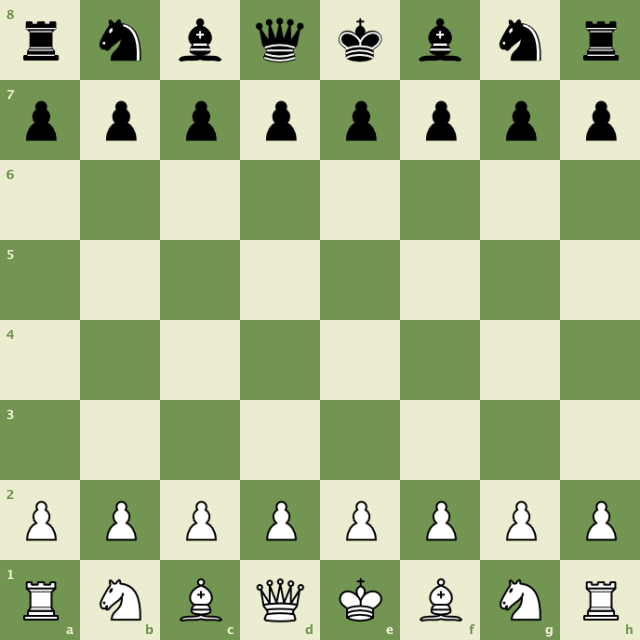

# Java Chess Image

**chessimage** is a Java library that generates chess board images from FEN (Forsyth-Edwards Notation).
This library offers customizable themes and board dimensions with high-quality visualization.



## Features

- Chess board rendering based on FEN notation
- Customizable themes with pre-defined options (Green and Brown themes included)
- Adjustable square sizes
- Integrated chess coordinates (A-H, 1-8)
- High-quality rendering with anti-aliasing

## Requirements

- Java 17 or higher

## Installation using JitPack

You can import this library into your project using [JitPack.io](https://jitpack.io/).
This allows you to manage the dependency through Maven or Gradle.

### Maven

Add the JitPack repository to your `pom.xml`:

```xml
<repositories>
    <repository>
        <id>jitpack.io</id>
        <url>https://jitpack.io</url>
    </repository>
</repositories>
```

Then add the dependency:
```xml
<dependency>
    <groupId>com.github.alexandreroman</groupId>
    <artifactId>chessimage</artifactId>
    <version>v1</version>
</dependency>
```

### Gradle

Add the JitPack repository to your root build.gradle:

```gradle
allprojects {
  repositories {
    maven { url 'https://jitpack.io' }
  }
}
```

Then add the dependency:

```gradle
dependencies {
    implementation 'com.github.alexandreroman:chessimage:v1'
}
```

This will use the stable `v1` release.
If you want to use a different version, replace `v1` with another release tag or commit hash.

## Usage

### Creating a renderer with default settings

```java
// Create a renderer with the default green theme and standard square size (80px)
ChessRenderer renderer = new ChessRenderer();

// Initial position in FEN notation
String fen = "rnbqkbnr/pppppppp/8/8/8/8/PPPPPPPP/RNBQKBNR w KQkq - 0 1";

// Generate and save the image
try (FileOutputStream out = new FileOutputStream("chess_position.png")) {
    renderer.render(fen, out);
}
```

### Using the Brown theme

```java
// Create a renderer with the brown theme
ChessRenderer renderer = new ChessRenderer(ChessThemeLibrary.BROWN_THEME);

// Custom FEN position
String fen = "r1bqk2r/pppp1ppp/2n2n2/2b1p3/2B1P3/2N2N2/PPPP1PPP/R1BQK2R w KQkq - 0 1";

// Generate and save the image
try (FileOutputStream out = new FileOutputStream("custom_position.png")) {
    renderer.render(fen, out);
}
```

### Customizing square size

```java
// Create a renderer with the green theme and 60px squares
ChessRenderer renderer = new ChessRenderer(ChessThemeLibrary.GREEN_THEME, 60);

// Generate and save the image
try (FileOutputStream out = new FileOutputStream("small_board.png")) {
    renderer.render(fen, out);
}
```

### Creating a custom theme

To create a new theme, create a new instance of the `ChessTheme` record:

```java
// Define a blue theme with custom colors
ChessTheme blueTheme = new ChessTheme(
    Color.decode("#E8EBF0"),  // Light square color (light blue-gray)
    Color.decode("#7389AE")   // Dark square color (medium blue)
);

// Create a renderer with the custom theme
ChessRenderer renderer = new ChessRenderer(blueTheme, 70);
```

## FEN Notation

[FEN](https://www.chess.com/terms/fen-chess) (Forsyth-Edwards Notation) is a standard for describing
a particular chess position.
An example of FEN notation for the initial position is:

```
rnbqkbnr/pppppppp/8/8/8/8/PPPPPPPP/RNBQKBNR w KQkq - 0 1
```

Where:
- Letters represent pieces (uppercase for white, lowercase for black)
    - `r` = rook, `n` = knight, `b` = bishop, `q` = queen, `k` = king, `p` = pawn
- Numbers represent consecutive empty squares
- Ranks are separated by forward slashes (`/`)
- The part after the first space contains additional information (turn to play, castling possibilities, etc.)

## Contributing

Contributions are always welcome!

Feel free to open issues & send PR.

## License

Copyright &copy; 2025 [Broadcom, Inc. or its affiliates](https://vmware.com).

This project is licensed under the [Apache Software License version 2.0](https://www.apache.org/licenses/LICENSE-2.0).
